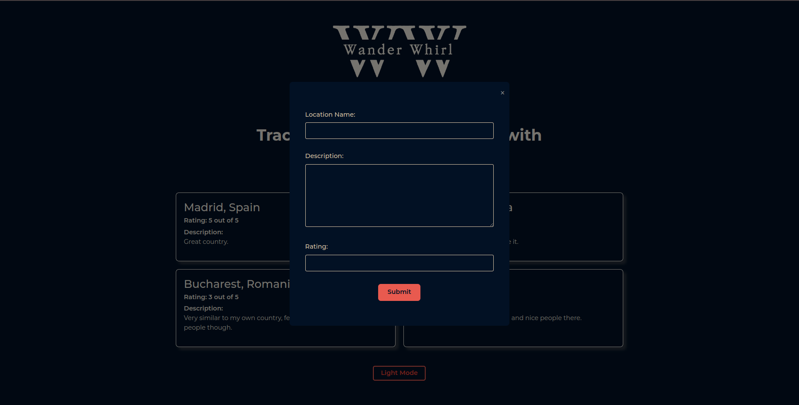

# Web Programming laboratory work no.6 - Front-end

# Description & flow of the app
Wander Whirl is a sleek travel destinations tracker designed for simplicity and ease of use. 

The app features a clean interface with a logo at the top and an introductory sentence. Users can add locations by clicking the "Add location" button, which opens a popup form. This form prompts users to enter the location name, description, and rating on a scale of 1 to 5 stars with 0.5 step increments.

Upon submission, the form closes, and users are returned to the main page where their entered location data is displayed in a card-like element. Each card showcases the location's details, allowing users to effortlessly keep track of their travel experiences.

Additionally, Wander Whirl offers a customizable viewing experience with a "Dark mode"/"Light mode" button located at the bottom of the page. This feature enables users to switch between different color themes to suit their preferences.

# Screenshots

# Laboratory task 
Create a client-side only web app on a free topic.

Description and flows of the app should be written in README.md

# Client requirements

- Have some kind of entities that can be manipulated (add/remove/like/filter)
  - example of entities: Books, Workouts, Movies, Students, Events, ...
- Have a custom theme/style (you can use css libraries but customize them to the needs)
  - Should have light/dark version
- App should be accesible with a public link

# Dev requirements

- Use one of [front-end frameworks/libraries](https://2022.stateofjs.com/en-US/libraries/front-end-frameworks/)
- All app state should be in runtime, some state should be stored in the browser (IndexedDB, localStorage)
- Have a decent git history to track the progress (`-2 points` if not respected)
  - You will be asked to checkout through commits to show working app at diferent stages
- App should be hosted on Github Pages (or similar static web apps hosting)
